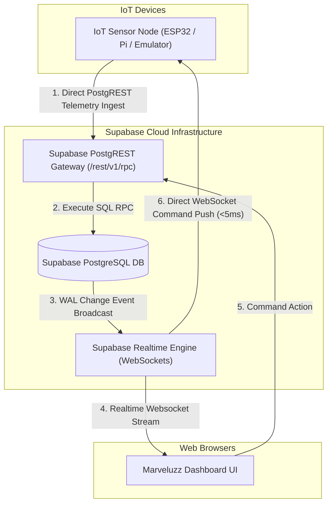

# Marveluzz Hub

> **Next-Gen Stateless IoT Management Dashboard & Control Hub**  
> Official successor to [`Every-Panel`](../every-panel/every-panel/spec.md).

---

## ⚡ Overview

`Marveluzz Hub` is an edge-native, self-configuring IoT management server and dashboard system. Built as a hybrid application leveraging **Supabase** (PostgreSQL & Realtime) and **Deno Deploy** (Stateless Edge Functions), it eliminates the high 24/7 memory-time overhead of traditional WebSocket servers while preserving live real-time telemetry streaming and exclusive control leases.

Unlike static dashboards, `Marveluzz Hub` does not hardcode sensor layouts. Connected **IoT nodes upload their own UI definitions** (a JSON array of 8 UI widget types), which the browser dashboard dynamically renders at runtime.

---

## ✨ Key Features

* **Zero-Memory Idle Edge Scaling**: Deno Deploy Edge Functions process incoming device requests in milliseconds and instantly spin down to **0 MB memory**, reducing monthly Deno Deploy usage to `< 1 GB-hour`.
* **Supabase Realtime Engine**: Web clients connect directly to Supabase Realtime for instant live telemetry broadcasts and UI schema updates without holding Deno isolates awake.
* **100% Direct-to-Supabase Mode (Zero-Server Operations)**: IoT microcontrollers can post telemetry directly to Supabase PostgREST (`/rest/v1/rpc/ingest_telemetry`) with <5ms direct WebSocket command push.
* **Self-Configuring UI (Device-Driven)**: IoT nodes supply their layout schema (buttons, sliders, gauges, text fields, charts, dividers, image streams) over HTTP POST.
* **Sleek Glassmorphism UI**: Identical dark-mode aesthetic to `Every-Panel` powered by Google Font *Outfit* and Chart.js telemetry plots.
* **7-State Diagnostic Status Machine**: Live visual state transitions (`disconnected`, `detached`, `initializing`, `stale`, `fault`, `live`, `control`).
* **Exclusive Control Lease**: Single-controller write lock for IoT nodes to prevent conflicting inputs across multiple browser tabs.
* **Fast Time-Series History**: PostgreSQL database indexing provides fast O(1) telemetry history retrieval.

---

## 🏗️ Architecture



---

## 📁 Project Structure

```
marveluzz-hub/
├── README.md             # Project documentation & overview
├── spec.md               # Detailed architectural specification & migration guide
├── supabase_schema.sql   # Complete Supabase SQL schema, RLS, and RPC functions
├── deno.json             # Task runner configuration
├── .github/
│   └── workflows/        # Automated GitHub Actions CI/CD deployment pipeline
│       └── deploy.yml
├── supabase/
│   └── migrations/       # Timestamped database migration setup scripts
│       └── 20260728000000_initial_schema.sql
├── src/
│   └── main.ts           # Stateless Deno Edge Server & SSE Broadcaster
├── public/
│   ├── index.html        # Main dashboard HTML template
│   ├── style.css         # Glassmorphism design tokens & styles
│   └── app.js            # Frontend logic, 7-state badge, & 8-widget renderer engine
├── examples/
│   ├── device_emulator.ts # Interactive IoT node simulator web panel (Port 8001, 30s interval)
│   └── esp32_device/     # ESP32 C++ Microcontroller Arduino firmware (5m interval)
│       └── esp32_device.ino
└── tests/
    ├── local_test.ts       # Local test suite (20 tests, no live services)
    ├── staging_test.ts     # Live staging integration test suite (5/5 passing)
    └── supabase_mock.ts    # Realistic Supabase in-memory mock engine
```

---

## 🔑 Recommended 4 Supabase Environment Variables

Supabase recommends configuring these 4 environment variables for edge & server deployments:

| Environment Variable | Description | Scope / Usage |
| :--- | :--- | :--- |
| `SUPABASE_URL` | Base API gateway URL (`https://<project-id>.supabase.co`) | Shared (Edge Server & Browser) |
| `SUPABASE_ANON_KEY` | Public anonymous API key (enforces Row Level Security) | Public (Client Browser / Realtime) |
| `SUPABASE_SERVICE_ROLE_KEY` | Admin secret API key (bypasses RLS for ingest RPCs) | Server-Only (Deno Edge Functions) |
| `SUPABASE_JWT_SECRET` | Secret key for verifying & decoding User JWT auth tokens | Server-Only (Offline Token Verification) |

---

## 🛠️ Production & Staging Environment Setup Guide

### 🚀 Live Staging Deployment URLs
- **Live Staging Dashboard**: Set `STAGING_URL` in `staging.env` (see `staging.env.example`)
- **Live Staging Database**: `https://qmketwlyeexumcxboagc.supabase.co`

---

### Step 1: Set Up Supabase Database (GitHub Integration)
1. Link your Supabase Cloud project (`qmketwlyeexumcxboagc`) to your GitHub repository under **Supabase Dashboard -> Integrations -> GitHub**.
2. Any `git push` automatically runs timestamped SQL migration scripts in `supabase/migrations/` to build all tables, RLS policies, and RPC stored procedures.

---

### Step 2: Deploy Edge Server to Deno Deploy
1. Log in to [Deno Deploy Dashboard](https://dash.deno.com).
2. Create a project linked to your GitHub repo and set the **Entrypoint** to `src/main.ts`.
3. Configure the 4 environment variables under **Settings -> Environment Variables**:
   ```env
   SUPABASE_URL=https://qmketwlyeexumcxboagc.supabase.co
   SUPABASE_ANON_KEY=<your-publishable-anon-key>
   SUPABASE_SERVICE_ROLE_KEY=<your-service-role-secret-key>
   SUPABASE_JWT_SECRET=<your-jwt-secret-key>
   ```

---

### Step 3: Commands & Test Runner

```bash
# 1. Run local test suite (20/20 passing)
deno task test

# 2. Run live staging integration test suite (read from staging.env)
deno task test:staging

# 3. Start local edge server
deno task dev

# 4. Start interactive IoT Device Emulator Panel on Port 8001 (30s interval)
deno task emulator
```

---

## 🔄 Deployment Synchronization & Architecture Specs

For complete deployment specifications, CLI promotion pipelines (`supabase db push`, `deployctl`), and staging environment workflows, refer to [`spec.md`](./spec.md).

---

## 📜 License

MIT License. See LICENSE for details.
