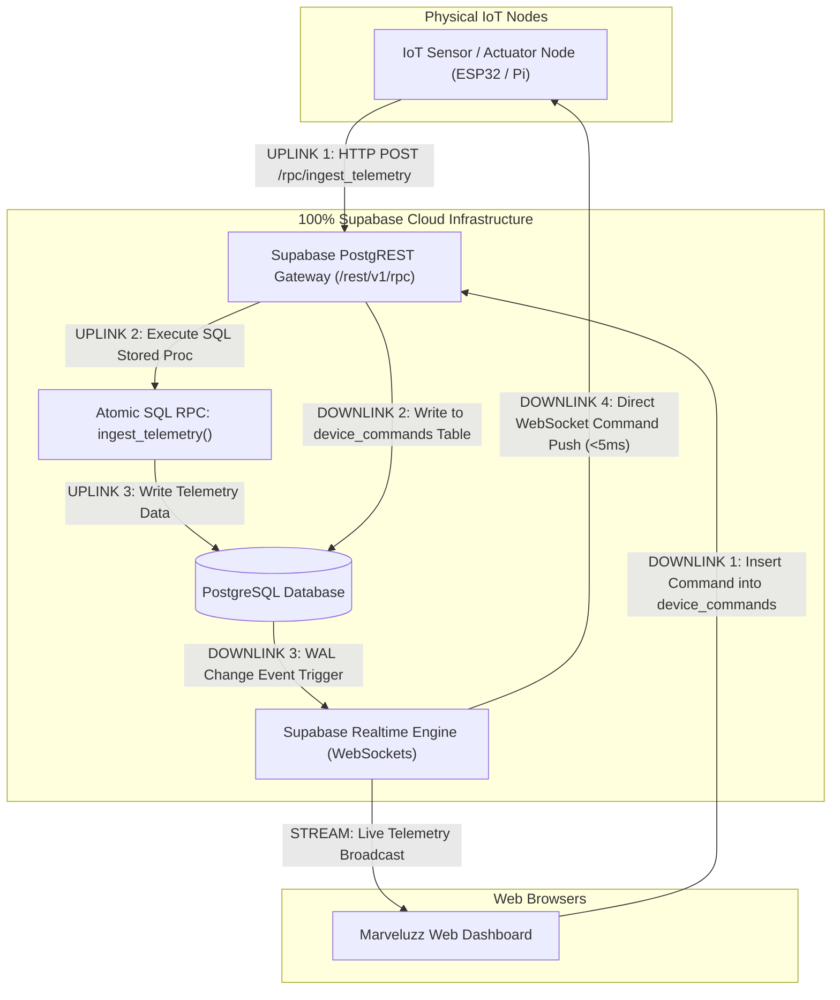
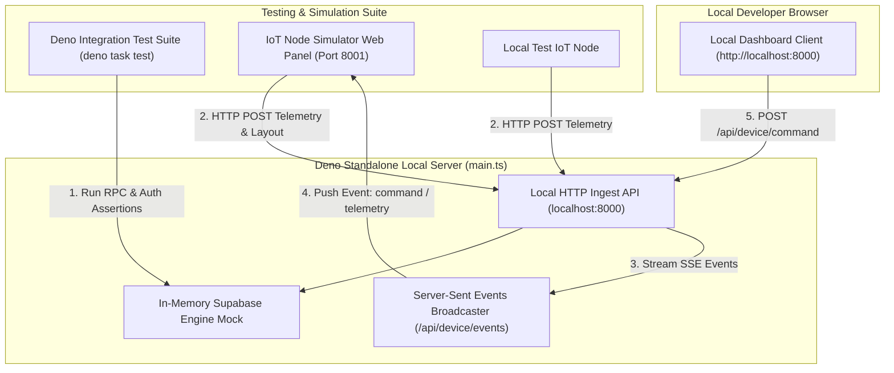
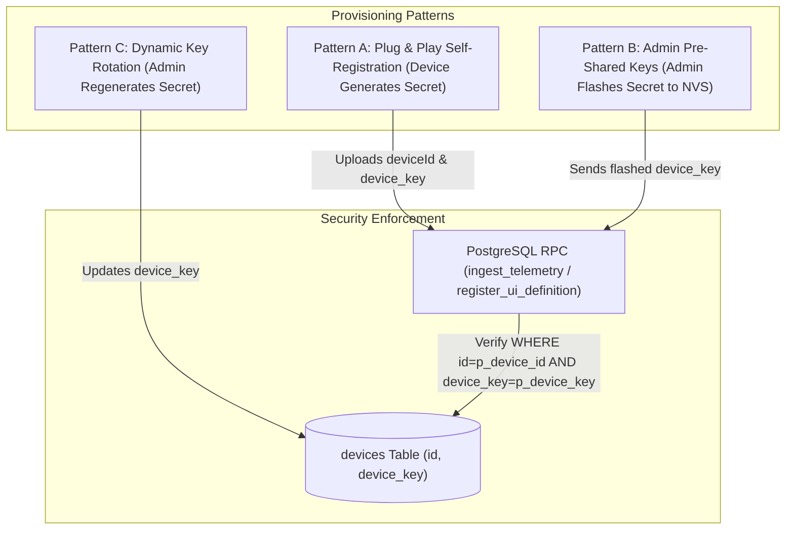
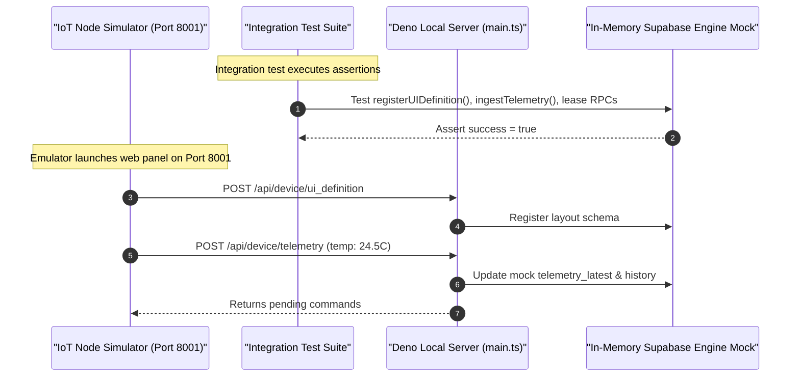
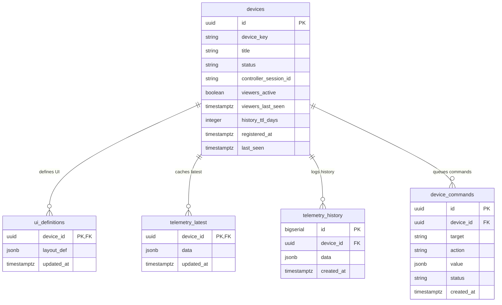

# Specification Document: Marveluzz Hub

This project is the official successor to [`every-panel spec.md`](file:///home/mik/Documents/Bastel/2023-/every-panel/every-panel/spec.md).

---

## 1. Project Overview & Evolution

`Marveluzz Hub` inherits and expands upon the core principles defined in `Every-Panel`. It provides an advanced, scalable, self-configuring IoT management server and dashboard system.

### Motivation & Problem Statement
In `Every-Panel`, maintaining persistent 24/7 WebSocket connections and Deno KV Watchers on Deno Deploy's free tier kept Deno isolates alive continuously, leading to high **memory time (GB-hours)** usage. 

To overcome this free-tier limitation, `Marveluzz Hub` introduces a **100% Direct-to-Supabase cloud architecture** alongside an offline **Standalone Local Testing Engine**.

---

## 2. System Architecture

### 2.1 System Architecture Diagrams

#### Diagram 1: Pure 100% Direct-to-Supabase Cloud Architecture (Production Mode)


---

#### Diagram 2: Standalone Local & Integration Testing Architecture (Testing & Dev Mode)


---

### 2.2 Dual Operating Mode Comparison

| Mode | Communication Target | Server Requirement | Primary Purpose |
| :--- | :--- | :--- | :--- |
| **Pure Supabase Mode (Production)** | `https://<project-id>.supabase.co` | **0 Intermediate Servers** | Zero-cost production cloud operations, <5ms command push. |
| **Standalone Local Mode (Testing)** | `http://localhost:8000` | Local Deno Process (`deno task dev`) | Offline development, integration testing, SSE streaming sandbox. |

---

### 2.3 Component Specifications

#### 1. Direct Supabase Ingest Engine (`supabase_schema.sql` / PostgREST)
* **Ingest Protocol**: IoT nodes send HTTP POST payloads directly to `https://<project-id>.supabase.co/rest/v1/rpc/ingest_telemetry`.
* **Zero Intermediate Server Overhead**: Completely bypasses external server infrastructure.
* **Per-Device Key Authentication**: Verified natively in PostgreSQL SQL functions.

#### 2. Deno Standalone Server & Local Engine (`src/main.ts`)
* **Execution Lifetime**: Stateless execution mode. Processes incoming HTTP REST & SSE payloads, falling back to an in-memory mock DB when local/standalone mode is enabled.
* **API Endpoints**:
  * `GET /api/device/events?deviceId=...`: Server-Sent Events (SSE) stream returning instant `connected`, `command`, `telemetry`, and `ui_definition` push events.
  * `POST /api/device/ui_definition`: Validates secret key and registers/updates dynamic UI layout schemas.
  * `POST /api/device/telemetry`: Validates secret key, updates `last_seen`, records latest telemetry snapshot, appends to historical log, and returns pending commands.
  * `POST /api/device/command`: Enqueues dashboard control commands for IoT nodes and broadcasts instant SSE `command` event.
  * `GET /api/devices`: Returns the list of registered devices, statuses, and registration timestamps.
  * `GET /api/devices/stats`: Returns memory and history storage footprint metrics for a device.
  * `POST /api/devices/delete`: Executes atomic device storage wipe.
  * `GET /api/debug/memory`: Returns RSS memory usage, isolate uptime, active SSE connections, and database mode.

#### 3. Supabase Storage & Realtime Engine
* **Data Persistence**: Uses PostgreSQL for high-speed time-series logging, layout storage, and device index management.
* **Realtime Layer**: Native Supabase Realtime (`supabase_realtime` publication) streams database updates (`UPDATE` / `INSERT`) directly to connected dashboard clients over WebSockets.
* **Row Level Security (RLS)**: Enforces access control rules for authenticated dashboard users and public anonymous keys.

#### 4. Frontend Dashboard Application (`public/index.html` & `public/app.js`)
* **Dynamic Widget Rendering**: Reads UI JSON schemas uploaded by IoT nodes and dynamically constructs visual cards (`number`, `range`, `button`, `indicator`, `text`, `divider`).
* **Direct Realtime Subscription**: Connects directly to Supabase Realtime WebSockets to display live telemetry changes without polling Deno Deploy.

---

### 2.4 Per-Device Secret Provisioning & Key Ownership Patterns

Marveluzz Hub supports strict **per-device secret key isolation**. Device A's secret key (`device_key`) cannot read or write data for Device B.



#### Provisioning Patterns:
1. **Pattern A: Self-Configuring Device Self-Registration**:
   * On initial boot, an IoT node generates its own `deviceId` (UUID) and secure random `deviceKey`.
   * It registers its layout via `POST /api/device/ui_definition`. Supabase creates the device record and locks in that `device_key`.
2. **Pattern B: Admin Pre-Shared Key (PSK) Provisioning**:
   * An administrator creates the device in the dashboard and flashes the provisioned `deviceId` and `deviceKey` directly into the microcontroller's non-volatile NVS / EEPROM flash memory.
3. **Pattern C: Dynamic Secret Key Rotation**:
   * Admins can regenerate a device's secret key at any time in `/devices/stats`, instantly invalidating compromised keys.

---

### 2.5 Recommended 4 Supabase Environment Variables

| Variable Name | Description | Security Scope |
| :--- | :--- | :--- |
| `SUPABASE_URL` | Base API Gateway endpoint (`https://<project-id>.supabase.co`) | Shared (Edge & Browser) |
| `SUPABASE_ANON_KEY` | Public anonymous API key (enforces RLS) | Public (Browser Client) |
| `SUPABASE_SERVICE_ROLE_KEY` | Admin secret key (bypasses RLS for ingest RPCs) | Server-Only (Deno Edge) |
| `SUPABASE_JWT_SECRET` | Secret key for verifying and decoding User JWT auth tokens | Server-Only (Offline Validation) |

---

### 2.6 Telemetry Ingest & Command Dispatch Sequence

#### Sequence Diagram 1: 100% Direct-to-Supabase Communication Sequence (Production Mode)

```mermaid
sequenceDiagram
    autonumber
    participant Node as "IoT Node / ESP32"
    participant PostgREST as "Supabase PostgREST Gateway"
    participant DB as "Supabase PostgreSQL DB"
    participant Realtime as "Supabase Realtime Engine"
    participant Dashboard as "Marveluzz Web Dashboard"

    Note over Node: Node connects WebSocket directly to Supabase Realtime
    Node->>Realtime: Connect wss://<project-id>.supabase.co/realtime/v1/websocket
    Realtime-->>Node: WebSocket Connected (Subscribed to device_commands)

    Note over Node: UPLINK: IoT Node posts telemetry directly to Supabase
    Node->>PostgREST: POST /rest/v1/rpc/ingest_telemetry (deviceId, deviceKey, data)
    PostgREST->>DB: Execute ingest_telemetry() SQL Procedure
    DB-->>Node: HTTP 200 OK { success: true }
    DB->>Realtime: WAL Change Broadcast (telemetry_latest UPDATE)
    Realtime-->>Dashboard: Stream live telemetry update over WebSocket

    Note over Dashboard: DOWNLINK: User clicks button on Web Dashboard
    Dashboard->>PostgREST: POST /rest/v1/device_commands (status: 'pending')
    PostgREST->>DB: INSERT INTO device_commands (target: fan_toggle, value: true)
    
    rect rgb(30, 40, 60)
        Note over Realtime: INSTANT COMMAND PUSH DOWN:
        DB->>Realtime: Write-Ahead Log (WAL) Change Event (INSERT device_commands)
        Realtime-->>Node: Direct WebSocket PUSH DOWN (<5ms): {"target":"fan_toggle","value":true}
    end

    Note over Node: IoT Node receives push DOWN instantly & flips hardware relay!
```



---

#### Sequence Diagram 2: Standalone Local & Integration Testing Sequence (Testing Path)



---

### 2.7 Entity-Relationship (ER) Schema



---

## 3. Data & Communication Flow

### Advantages of the Hybrid Approach:
* **Near-Zero Server Costs**: Direct Supabase PostgREST ingest requires 0 Deno Deploy memory time.
* **Scalable Data History**: Supabase PostgreSQL handles large historical time-series telemetry querying seamlessly (`idx_telemetry_history_device_created` index).
* **Decoupled Realtime Layer**: Web clients receive real-time UI updates directly from Supabase Realtime.

---

## 4. Step-by-Step Feature Migration Plan (Every-Panel -> Marveluzz Hub)

### Phase 1: Database & RPC Enhancements (`supabase_schema.sql`) — [COMPLETE]
- [x] **Step 1.1: Core Tables Setup**: Implement `devices`, `ui_definitions`, `telemetry_latest`, `telemetry_history`, and `device_commands`.
- [x] **Step 1.2: Add Power-Saving Viewer Presence**: Add `viewers_active` (boolean) & `viewers_last_seen` columns to `devices` table. Update `ingest_telemetry` RPC to return `viewers_active` so IoT nodes can pause high-frequency sampling when no UI tabs are open.
- [x] **Step 1.3: Control Lease Atomic RPCs**: Implement `acquire_control_lease(p_device_id, p_session_id)` and `release_control_lease(p_device_id, p_session_id)` stored procedures to enforce single-controller lock semantics in Postgres.
- [x] **Step 1.4: Storage Stats & Data Cleanup RPC**: Implement `wipe_device_data(p_device_id)` RPC function to delete telemetry history, layout schemas, and commands for storage maintenance.
- [x] **Step 1.5: History Retention TTL Management**: Add `history_ttl_days` column (default 7 days) and `purge_expired_telemetry()` PostgreSQL function to clean up telemetry logs older than `history_ttl_days`.

### Phase 2: Edge Server & REST / SSE Ingest (`src/main.ts`) — [COMPLETE]
- [x] **Step 2.1: Telemetry & Layout Ingest APIs**: Implement `/api/device/telemetry` and `/api/device/ui_definition`.
- [x] **Step 2.2: Device Directory API**: Implement `/api/devices` GET list endpoint.
- [x] **Step 2.3: Device Storage Stats & Settings APIs**: Implement `/api/devices/stats` GET and `/api/devices/delete` POST endpoints for storage footprint metrics and wiping device data.
- [x] **Step 2.4: Memory & Health Diagnostics API**: Implement `/api/debug/memory` endpoint returning RSS memory stats, isolate uptime, active SSE streams, and database mode.
- [x] **Step 2.5: Server-Sent Events (SSE) Endpoint**: Implement `/api/device/events` for instant command push streaming to IoT microcontrollers.

### Phase 3: Frontend Dashboard UI Parity (`public/app.js` & `public/index.html`)
- [x] **Step 3.1: Glassmorphism Theme & Layout**: Apply Google Font *Outfit* and glass dark-mode tokens.
- [ ] **Step 3.2: Complete 7-State Diagnostic Status Machine**:
  - Implement full status badge state transitions: `disconnected` (gray pulse), `detached` (red), `initializing` (orange pulse), `stale` (pink pulse), `fault` (red pulse), `live` (amber), `control` (green).
  - Implement keepalive timeout detector for `stale` status when server/realtime pings fail.
- [ ] **Step 3.3: Complete 8-Widget Renderer Engine**:
  - Support `number`, `range` / `slider`, `button` (edge/click), `text` / `text_view`, `indicator` / `badge`, `img` (webcam viewer), `divider`, `chart` (time-series plot).
- [ ] **Step 3.4: Control Lease Toggle UI**: Add `Acquire Control` / `Release Control` header buttons and input lock overlays (`disabled-overlay`) for view-only users.
- [ ] **Step 3.5: Storage Stats & Wipe Modal UI**: Build `/devices/stats` view with secret key display and confirmation modal for wiping device storage.

### Phase 4: IoT Node Simulator & Firmware Parity (`examples/device_emulator.ts`)
- [x] **Step 4.1: Interactive Web Panel Emulator**: Implement standalone web panel running on Port 8001.
- [ ] **Step 4.2: Hardware Fault & Power-Saving Feedback**:
  - Implement `viewers_active` / `viewers_inactive` handling to adjust auto-stream frequency.
  - Test hardware fault code (`E-04`) simulation and emergency button edge triggers.

### Phase 5: Verification & Quality Assurance
- [x] **Step 5.1: Deno Integration Test Suite**: Implement `tests/integration_test.ts` and `tests/supabase_mock.ts`.
- [ ] **Step 5.2: End-to-End Test Suite**: Add tests covering 7-state badge transitions, lease acquisition, storage wipe, and telemetry ingest under mock DB and Supabase production backends.

### Phase 6: One-Time Authentication & Device Pairing Workflow — [TODO]
- [ ] **Step 6.1: One-Time Authentication & Zero-Dashboard PIN Pairing**:
  - Implement 6-digit PIN one-time pairing endpoint (`POST /api/device/pair`) for Zero-Dashboard Plug & Play onboarding.
  - Implement Hub UI "+ Add New Device" modal with 6-digit PIN generator & QR code renderer.
  - Implement ESP32 captive portal auto-discovery handshake to receive and store `deviceId` and `deviceKey` permanently in NVS Flash memory upon valid PIN authentication.

---

## 5. Deployment Synchronization & Contract Security (Deno Deploy <-> Supabase)

Synchronization and API contract integrity between Deno Deploy and Supabase are guaranteed through 5 architectural mechanisms:

1. **SQL Schema as Single Source of Truth (`supabase_schema.sql`)**: All table definitions, RLS security rules, and RPC functions are version-controlled in git and pushed to Supabase via Supabase CLI (`supabase db push`).
2. **Strict RPC Encapsulation (No Raw SQL Queries)**: Deno Deploy never runs raw SQL or ad-hoc table queries. It interacts with PostgreSQL strictly via named Stored Procedures (`ingest_telemetry`, `register_ui_definition`, `acquire_control_lease`, `wipe_device_data`), enforcing strict typed function parameters.
3. **Dual-Backend Test Suite Verification (`tests/integration_test.ts`)**: The test suite runs against `MockSupabaseEngine`, which mirrors `supabase_schema.sql` 1:1, verifying function signatures before deployment.
4. **Supabase Realtime Stream Auto-Publishing (`supabase_realtime`)**: PostgreSQL Write-Ahead Logging (WAL) triggers change broadcasts automatically on every database RPC write, ensuring real-time UI synchronization.
5. **CI/CD Automated Deployment Pipeline**: GitHub Actions runs `deno task test`, applies database migrations via `supabase db push`, and deploys edge code to Deno Deploy simultaneously.

---

## 6. Detailed Integration & Staging Environment Architecture

The Staging Environment provides an isolated, production-identical testing sandbox combining a dedicated **Supabase Staging Project** and a **Deno Deploy Staging Project**.

### 6.1 Environment Isolation & Credential Matrix

| Environment | Supabase Project Ref | Deno Deploy Project | Target URL | DB Isolation |
| :--- | :--- | :--- | :--- | :--- |
| **Local CLI** | `In-Memory Mock` | `localhost:8000` | `http://localhost:8000` | Isolated RAM / Mock |
| **Staging** | `<staging-project-id>` | `marveluzz-hub-staging` | `https://marveluzz-hub-staging.deno.dev` | Staging Postgres Cloud DB |
| **Production** | `<prod-project-id>` | `marveluzz-hub` | `https://marveluzz-hub.deno.dev` | Production Postgres Cloud DB |

---

### 6.2 Alignment with Native Deno Deploy Staging Features

`Marveluzz Hub` aligns directly with Deno Deploy's native environment management and preview features:

1. **Native Preview Deployments (Branch & Pull Request Isolation)**:
   * When pushing code to a Git branch or opening a PR, Deno Deploy automatically generates an isolated **Preview Deployment URL** (e.g. `https://marveluzz-hub-preview-<hash>.deno.dev`).
2. **Environment Variable Scoping per Environment**:
   * Deno Deploy allows scoping environment variables to **Production** or **Preview** environments.
   * Preview deployments automatically read Staging Supabase credentials (`https://<staging-project-id>.supabase.co`), while Production deployments read Production credentials—requiring zero code branching.
3. **Instant Zero-Downtime Traffic Promotion & Rollbacks**:
   * Because Deno Edge Functions are 100% stateless (state lives in Supabase), promoting a Preview deployment to Production is instantaneous. If an anomaly occurs, 1-click rollback instantly restores the previous stable isolate revision.
4. **GitHub Pull Request Integration**:
   * Deno Deploy posts live preview links directly to GitHub PRs, allowing team members to test telemetry ingest with `examples/device_emulator.ts` against staging before merging.

---

## 7. Direct IoT-to-Supabase Connectivity Solutions (Bypassing Edge Servers)

IoT devices can connect **directly to Supabase** using both stateless or permanent connection protocols:

### Solution A: Direct PostgREST RPC Ingest (Stateless HTTP/HTTPS)
IoT microcontrollers (ESP32, ESP8266, Raspberry Pi) send standard HTTP POST requests directly to Supabase's built-in PostgREST API endpoint:

```
POST https://<project-id>.supabase.co/rest/v1/rpc/ingest_telemetry
Headers:
  apikey: <SUPABASE_ANON_KEY>
  Content-Type: application/json
Body:
  {
    "p_device_id": "32323232-3232-4232-8232-28c13340c86c",
    "p_device_key": "secret_passcode_123",
    "p_telemetry_data": { "temperature": 24.5, "uptime": "120s" }
  }
```

### Solution B: Permanent WebSocket Connection (Supabase Realtime)
IoT devices maintain a persistent WebSocket connection directly to Supabase Realtime for sub-millisecond bidirectional streaming:

```
wss://<project-id>.supabase.co/realtime/v1/websocket?apikey=<SUPABASE_ANON_KEY>&vsn=1.0.0
```
* **Channel Subscription**: Devices subscribe to topic `realtime:public:device_commands:device_id=eq.<device_id>` to receive instant command pushes from dashboard users.
* **Presence & Telemetry**: Devices broadcast telemetry data directly over the WebSocket channel.

### Solution C: Server-Sent Events (SSE Stream Endpoint `/api/device/events`)
IoT devices open a persistent HTTP `GET` stream (`Accept: text/event-stream`) to listen for real-time command events, while sending telemetry updates via standard HTTP POST calls.
