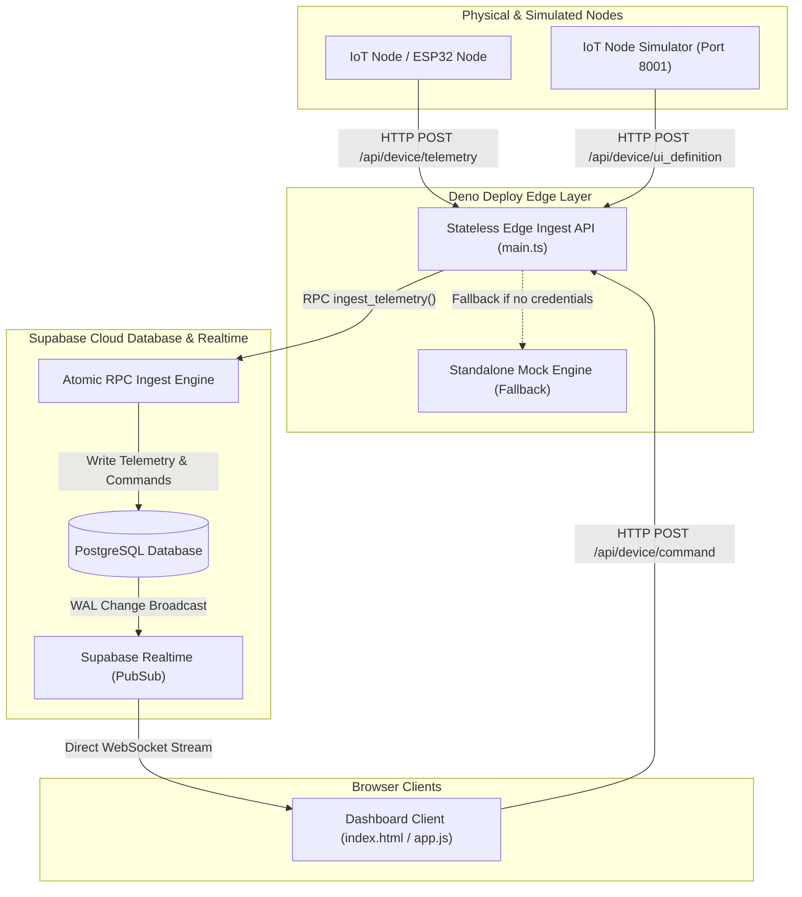
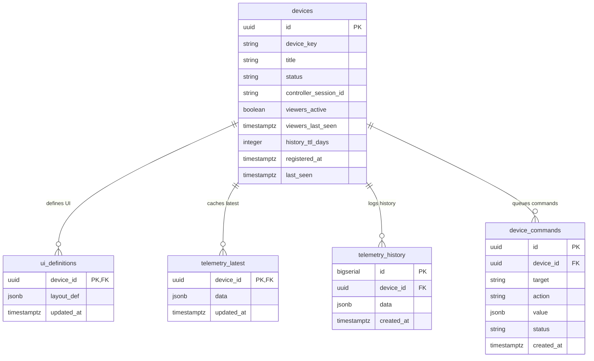

# Specification Document: Marveluzz Hub

This project is the official successor to [`every-panel spec.md`](file:///home/mik/Documents/Bastel/2023-/every-panel/every-panel/spec.md).

---

## 1. Project Overview & Evolution

`Marveluzz Hub` inherits and expands upon the core principles defined in `Every-Panel`. It provides an advanced, scalable, self-configuring IoT management server and dashboard system.

### Motivation & Problem Statement
In `Every-Panel`, maintaining persistent 24/7 WebSocket connections and Deno KV Watchers on Deno Deploy's free tier kept Deno isolates alive continuously, leading to high **memory time (GB-hours)** usage. 

To overcome this free-tier limitation, `Marveluzz Hub` introduces a **stateless Edge + Supabase hybrid architecture**.

---

## 2. System Architecture

### 2.1 Multi-Region Cloud & Edge Deployment Architecture

---

### 2.2 Component Specifications

#### 1. Stateless Edge Ingest Server (`src/main.ts`)
* **Execution Lifetime**: Stateless execution mode. Isolate instances boot in <10ms, process incoming HTTP REST payloads, and immediately spin down to 0 MB memory.
* **API Endpoints**:
  * `POST /api/device/ui_definition`: Validates secret key and registers/updates dynamic UI layout schemas.
  * `POST /api/device/telemetry`: Validates secret key, updates `last_seen`, records latest telemetry snapshot, appends to historical log, and returns pending commands.
  * `POST /api/device/command`: Enqueues dashboard control commands for IoT nodes.
  * `GET /api/devices`: Returns the list of registered devices, statuses, and registration timestamps.
  * `GET /api/devices/stats`: Returns memory and history storage footprint metrics for a device.
  * `POST /api/devices/delete`: Executes atomic device storage wipe.
  * `GET /api/debug/memory`: Returns RSS memory usage, isolate uptime, and database mode.

#### 2. Supabase Storage & Realtime Engine (`supabase_schema.sql`)
* **Data Persistence**: Uses PostgreSQL for high-speed time-series logging, layout storage, and device index management.
* **Realtime Layer**: Native Supabase Realtime (`supabase_realtime` publication) streams database updates (`UPDATE` / `INSERT`) directly to connected dashboard clients over WebSockets.
* **Row Level Security (RLS)**: Enforces access control rules for authenticated dashboard users and public anonymous keys.

#### 3. Frontend Dashboard Application (`public/index.html` & `public/app.js`)
* **Dynamic Widget Rendering**: Reads UI JSON schemas uploaded by IoT nodes and dynamically constructs visual cards (`number`, `range`, `button`, `indicator`, `text`, `divider`).
* **Direct Realtime Subscription**: Connects directly to Supabase Realtime WebSockets to display live telemetry changes without polling Deno Deploy.

---

### 2.3 Recommended 4 Supabase Environment Variables

| Variable Name | Description | Security Scope |
| :--- | :--- | :--- |
| `SUPABASE_URL` | Base API Gateway endpoint (`https://<project-id>.supabase.co`) | Shared (Edge & Browser) |
| `SUPABASE_ANON_KEY` | Public anonymous API key (enforces RLS) | Public (Browser Client) |
| `SUPABASE_SERVICE_ROLE_KEY` | Admin secret key (bypasses RLS for ingest RPCs) | Server-Only (Deno Edge) |
| `SUPABASE_JWT_SECRET` | Secret key for verifying and decoding User JWT auth tokens | Server-Only (Offline Validation) |

---

### 2.4 Telemetry Ingest & Command Dispatch Sequence

```mermaid
sequenceDiagram
    autonumber
    participant Node as "IoT Node / Simulator"
    participant Edge as "Deno Edge Ingest"
    participant DB as "Supabase PostgreSQL"
    participant Realtime as "Supabase Realtime"
    participant UI as "Dashboard Browser"

    Note over UI: User clicks "Toggle Cooling Fan"
    UI->>Edge: POST /api/device/command (target: fan_toggle, value: true)
    Edge->>DB: INSERT INTO device_commands (status: 'pending')
    DB-->>Edge: Returns command_id

    Note over Node: Node sends periodic telemetry (e.g. every 3s)
    Node->>Edge: POST /api/device/telemetry (deviceId, deviceKey, data)
    Edge->>DB: SELECT rpc('ingest_telemetry', deviceId, deviceKey, data)
    
    rect rgb(30, 40, 60)
        Note over DB: Atomic DB Transaction:
        DB->>DB: 1. Verify device_key match
        DB->>DB: 2. Update last_seen & status = 'live'
        DB->>DB: 3. Upsert telemetry_latest
        DB->>DB: 4. Append to telemetry_history
        DB->>DB: 5. Fetch & mark pending commands as 'executed'
    end

    DB-->>Edge: Returns executed commands array
    Edge-->>Node: HTTP 200 OK { success: true, commands: [fan_toggle] }
    
    DB->>Realtime: Trigger WAL Change Event (telemetry_latest UPDATE)
    Realtime->>UI: Broadcast updated telemetry JSON
    
    Note over Node: Node receives command and flips relay
```

---

### 2.5 Entity-Relationship (ER) Schema

---

## 3. Data & Communication Flow

### Advantages of the Hybrid Approach:
* **Near-Zero Deno Deploy Costs**: Memory time on Deno Deploy drops to `< 1 GB-hour/month` because isolates only execute during active request handling.
* **Scalable Data History**: Supabase PostgreSQL handles large historical time-series telemetry querying seamlessly (`idx_telemetry_history_device_created` index).
* **Decoupled Realtime Layer**: Web clients receive real-time UI updates directly from Supabase Realtime.

---

## 4. Step-by-Step Feature Migration Plan (Every-Panel -> Marveluzz Hub)

### Phase 1: Database & RPC Enhancements (`supabase_schema.sql`) — [COMPLETE]
- [x] **Step 1.1: Core Tables Setup**: Implement `devices`, `ui_definitions`, `telemetry_latest`, `telemetry_history`, and `device_commands`.
- [x] **Step 1.2: Add Power-Saving Viewer Presence**: Add `viewers_active` (boolean) & `viewers_last_seen` columns to `devices` table. Update `ingest_telemetry` RPC to return `viewers_active` so IoT nodes can pause high-frequency sampling when no UI tabs are open.
- [x] **Step 1.3: Control Lease Atomic RPCs**: Implement `acquire_control_lease(p_device_id, p_session_id)` and `release_control_lease(p_device_id, p_session_id)` stored procedures to enforce single-controller lock semantics in Postgres.
- [x] **Step 1.4: Storage Stats & Data Cleanup RPC**: Implement `wipe_device_data(p_device_id)` RPC function to delete telemetry history, layout schemas, and commands for storage maintenance.
- [x] **Step 1.5: History Retention TTL Management**: Add `history_ttl_days` column (default 7 days) and `purge_expired_telemetry()` PostgreSQL function to clean up telemetry logs older than `history_ttl_days`.

### Phase 2: Edge Server & REST Ingest (`src/main.ts`) — [COMPLETE]
- [x] **Step 2.1: Telemetry & Layout Ingest APIs**: Implement `/api/device/telemetry` and `/api/device/ui_definition`.
- [x] **Step 2.2: Device Directory API**: Implement `/api/devices` GET list endpoint.
- [x] **Step 2.3: Device Storage Stats & Settings APIs**: Implement `/api/devices/stats` GET and `/api/devices/delete` POST endpoints for storage footprint metrics and wiping device data.
- [x] **Step 2.4: Memory & Health Diagnostics API**: Implement `/api/debug/memory` endpoint returning RSS memory stats, isolate uptime, and database mode.
- [x] **Step 2.5: Optional Auth & GitHub OAuth**: Support 4 standard Supabase Environment Variables (`SUPABASE_URL`, `SUPABASE_ANON_KEY`, `SUPABASE_SERVICE_ROLE_KEY`, `SUPABASE_JWT_SECRET`) with automatic standalone mock fallback.

### Phase 3: Frontend Dashboard UI Parity (`public/app.js` & `public/index.html`)
- [x] **Step 3.1: Glassmorphism Theme & Layout**: Apply Google Font *Outfit* and glass dark-mode tokens.
- [ ] **Step 3.2: Complete 7-State Diagnostic Status Machine**:
  - Implement full status badge state transitions: `disconnected` (gray pulse), `detached` (red), `initializing` (orange pulse), `stale` (pink pulse), `fault` (red pulse), `live` (amber), `control` (green).
  - Implement keepalive timeout detector for `stale` status when server/realtime pings fail.
- [ ] **Step 3.3: Complete 8-Widget Renderer Engine**:
  - Support `number`, `range` / `slider`, `button` (edge/click), `text` / `text_view`, `indicator` / `badge`, `img` (webcam viewer), `divider`, `chart` (time-series plot).
- [ ] **Step 3.4: Control Lease Toggle UI**: Add `Acquire Control` / `Release Control` header buttons and input lock overlays (`disabled-overlay`) for view-only users.
- [ ] **Step 3.5: Storage Stats & Wipe Modal UI**: Build `/devices/stats` view with secret key display and confirmation modal for wiping device storage.

### Phase 4: IoT Node Simulator & Firmware Parity (`examples/device_emulator.ts`)
- [x] **Step 4.1: Interactive Web Panel Emulator**: Implement standalone web panel running on Port 8001.
- [ ] **Step 4.2: Hardware Fault & Power-Saving Feedback**:
  - Implement `viewers_active` / `viewers_inactive` handling to adjust auto-stream frequency.
  - Test hardware fault code (`E-04`) simulation and emergency button edge triggers.

### Phase 5: Verification & Quality Assurance
- [x] **Step 5.1: Deno Integration Test Suite**: Implement `tests/integration_test.ts` and `tests/supabase_mock.ts`.
- [ ] **Step 5.2: End-to-End Test Suite**: Add tests covering 7-state badge transitions, lease acquisition, storage wipe, and telemetry ingest under mock DB and Supabase production backends.

---

## 5. Deployment Synchronization & Contract Security (Deno Deploy <-> Supabase)

Synchronization and API contract integrity between Deno Deploy and Supabase are guaranteed through 5 architectural mechanisms:

1. **SQL Schema as Single Source of Truth (`supabase_schema.sql`)**: All table definitions, RLS security rules, and RPC functions are version-controlled in git and pushed to Supabase via Supabase CLI (`supabase db push`).
2. **Strict RPC Encapsulation (No Raw SQL Queries)**: Deno Deploy never runs raw SQL or ad-hoc table queries. It interacts with PostgreSQL strictly via named Stored Procedures (`ingest_telemetry`, `register_ui_definition`, `acquire_control_lease`, `wipe_device_data`), enforcing strict typed function parameters.
3. **Dual-Backend Test Suite Verification (`tests/integration_test.ts`)**: The test suite runs against `MockSupabaseEngine`, which mirrors `supabase_schema.sql` 1:1, verifying function signatures before deployment.
4. **Supabase Realtime Stream Auto-Publishing (`supabase_realtime`)**: PostgreSQL Write-Ahead Logging (WAL) triggers change broadcasts automatically on every database RPC write, ensuring real-time UI synchronization.
5. **CI/CD Automated Deployment Pipeline**: GitHub Actions runs `deno task test`, applies database migrations via `supabase db push`, and deploys edge code to Deno Deploy simultaneously.

---

## 6. Detailed Integration & Staging Environment Architecture

The Staging Environment provides an isolated, production-identical testing sandbox combining a dedicated **Supabase Staging Project** and a **Deno Deploy Staging Project**.

### 6.1 Environment Isolation & Credential Matrix

| Environment | Supabase Project Ref | Deno Deploy Project | Target URL | DB Isolation |
| :--- | :--- | :--- | :--- | :--- |
| **Local CLI** | `In-Memory Mock` | `localhost:8000` | `http://localhost:8000` | Isolated RAM / Mock |
| **Staging** | `<staging-project-id>` | `marveluzz-hub-staging` | `https://marveluzz-hub-staging.deno.dev` | Staging Postgres Cloud DB |
| **Production** | `<prod-project-id>` | `marveluzz-hub` | `https://marveluzz-hub.deno.dev` | Production Postgres Cloud DB |

---

### 6.2 Alignment with Native Deno Deploy Staging Features

`Marveluzz Hub` aligns directly with Deno Deploy's native environment management and preview features:

1. **Native Preview Deployments (Branch & Pull Request Isolation)**:
   * When pushing code to a Git branch or opening a PR, Deno Deploy automatically generates an isolated **Preview Deployment URL** (e.g. `https://marveluzz-hub-preview-<hash>.deno.dev`).
2. **Environment Variable Scoping per Environment**:
   * Deno Deploy allows scoping environment variables to **Production** or **Preview** environments.
   * Preview deployments automatically read Staging Supabase credentials (`https://<staging-project-id>.supabase.co`), while Production deployments read Production credentials—requiring zero code branching.
3. **Instant Zero-Downtime Traffic Promotion & Rollbacks**:
   * Because Deno Edge Functions are 100% stateless (state lives in Supabase), promoting a Preview deployment to Production is instantaneous. If an anomaly occurs, 1-click rollback instantly restores the previous stable isolate revision.
4. **GitHub Pull Request Integration**:
   * Deno Deploy posts live preview links directly to GitHub PRs, allowing team members to test telemetry ingest with `examples/device_emulator.ts` against staging before merging.
