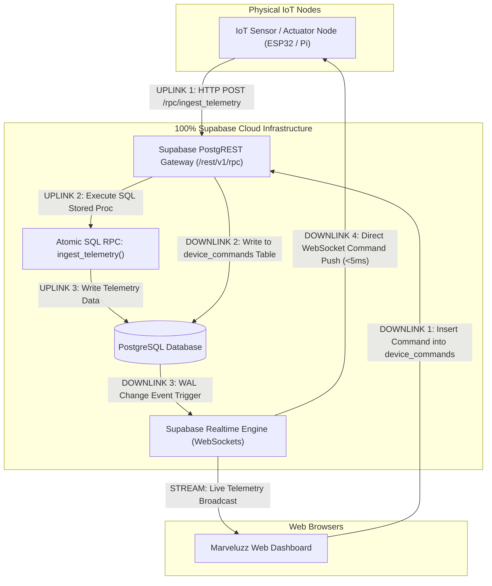
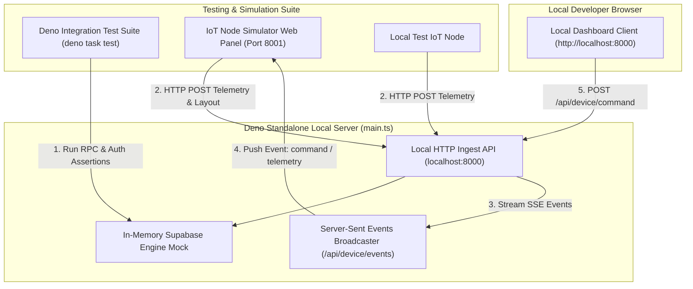
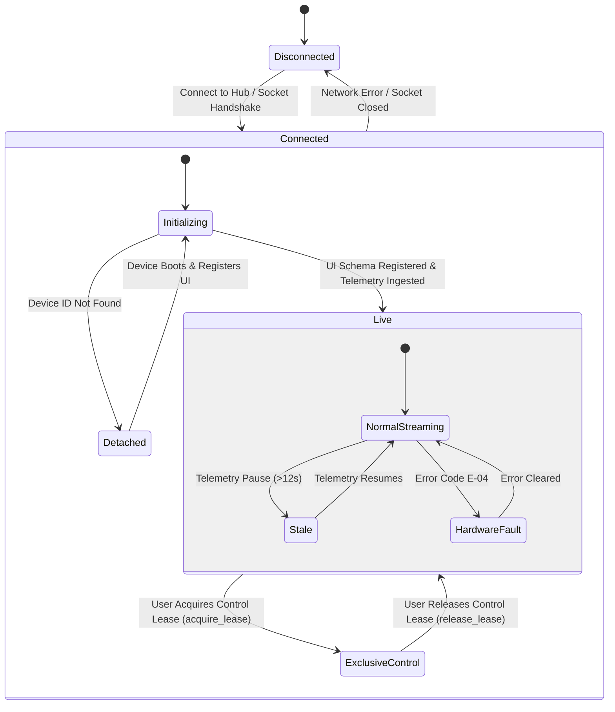
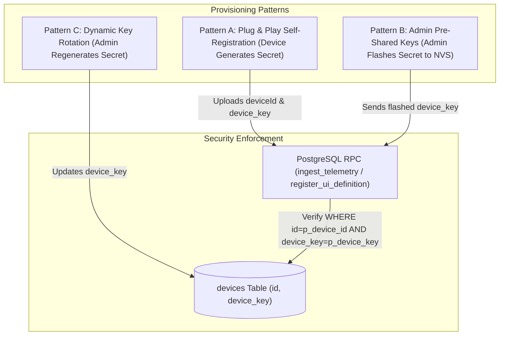
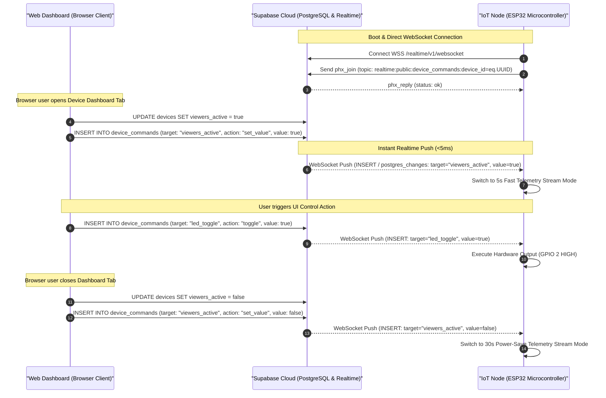
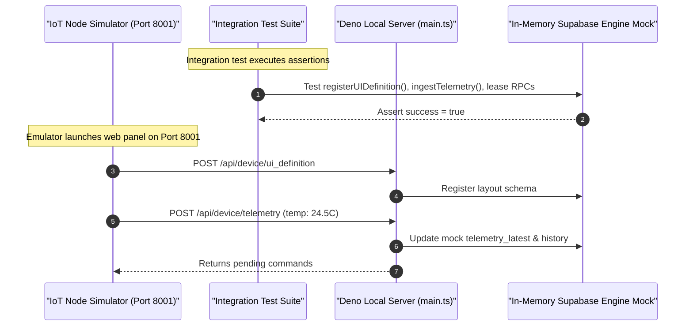
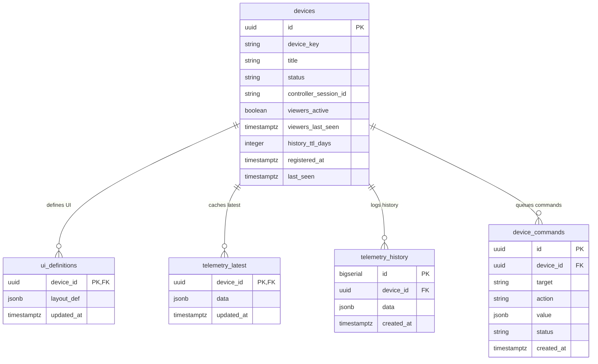

# Specification Document: Marveluzz Hub

This project is the official successor to `every-panel spec.md`.

---

## 1. Project Overview & Evolution

`Marveluzz Hub` inherits and expands upon the core principles defined in `Every-Panel`. It provides an advanced, scalable, self-configuring IoT management server and dashboard system.

### Motivation & Problem Statement
In `Every-Panel`, maintaining persistent 24/7 WebSocket connections and Deno KV Watchers on Deno Deploy's free tier kept Deno isolates alive continuously, leading to high **memory time (GB-hours)** usage. 

To overcome this free-tier limitation, `Marveluzz Hub` introduces a **100% Direct-to-Supabase cloud architecture** alongside an offline **Standalone Local Testing Engine**.

---

## 2. System Architecture

### 2.1 System Architecture Diagrams

#### Diagram 1: Pure 100% Direct-to-Supabase Cloud Architecture (Production Mode)


---

#### Diagram 2: Standalone Local & Integration Testing Architecture (Testing & Dev Mode)


---

#### Diagram 3: High-Level Diagnostic State Machine Diagram


---

### 2.2 Dual Operating Mode Comparison

| Mode | Communication Target | Server Requirement | Primary Purpose |
| :--- | :--- | :--- | :--- |
| **Pure Supabase Mode (Production)** | `https://<project-id>.supabase.co` | **0 Intermediate Servers** | Zero-cost production cloud operations, <5ms command push. |
| **Standalone Local Mode (Testing)** | `http://localhost:8000` | Local Deno Process (`deno task dev`) | Offline development, integration testing, SSE streaming sandbox. |

---

### 2.3 Component Specifications

#### 1. Direct Supabase Ingest Engine (`supabase_schema.sql` / PostgREST)
* **Ingest Protocol**: IoT nodes send HTTP POST payloads directly to `https://<project-id>.supabase.co/rest/v1/rpc/ingest_telemetry`.
* **Zero Intermediate Server Overhead**: Completely bypasses external server infrastructure.
* **Per-Device Key Authentication**: Verified natively in PostgreSQL SQL functions.

#### 2. Deno Standalone Server & Local Engine (`src/main.ts`)
* **Execution Lifetime**: Stateless execution mode. Processes incoming HTTP REST & SSE payloads, falling back to an in-memory mock DB when local/standalone mode is enabled.
* **API Endpoints**:
  * `GET /api/device/events?deviceId=...`: Server-Sent Events (SSE) stream returning instant `connected`, `command`, `telemetry`, and `ui_definition` push events.
  * `POST /api/device/ui_definition`: Validates secret key and registers/updates dynamic UI layout schemas.
  * `POST /api/device/telemetry`: Validates secret key, updates `last_seen`, records latest telemetry snapshot, appends to historical log, and returns pending commands.
  * `POST /api/device/command`: Enqueues dashboard control commands for IoT nodes and broadcasts instant SSE `command` event.
  * `GET /api/devices`: Returns the list of registered devices, statuses, and registration timestamps.
  * `GET /api/devices/stats` (or `/api/device/stats`): Returns storage footprint metrics, record counts, active retention TTL, masked secret key, and stored layout definition for a device.
  * `POST /api/device/rotate_key`: Rotates the device secret key, rendering old keys invalid immediately.
  * `POST /api/device/update_retention`: Updates the time-series history retention TTL policy (7, 14, 30, 90 days).
  * `POST /api/device/purge_telemetry`: Purges all telemetry history logs for a specific device.
  * `POST /api/devices/delete`: Executes storage wipe (`deleteRecord: false`) or complete device registration deletion (`deleteRecord: true`).
  * `GET /api/debug/memory`: Returns RSS memory usage, isolate uptime, active SSE connections, and database mode.

#### 3. Supabase Storage & Realtime Engine
* **Data Persistence**: Uses PostgreSQL for high-speed time-series logging, layout storage, and device index management.
* **Realtime Layer**: Native Supabase Realtime (`supabase_realtime` publication) streams database updates (`UPDATE` / `INSERT`) directly to connected dashboard clients over WebSockets.
* **Row Level Security (RLS)**: Enforces access control rules for authenticated dashboard users and public anonymous keys.

#### 4. Frontend Dashboard Application (`public/index.html` & `public/app.js`)
* **Dynamic Widget Rendering**: Reads UI JSON schemas uploaded by IoT nodes and dynamically constructs visual cards (`number`, `range`, `button`, `indicator`, `text`, `divider`).
* **Direct Realtime Subscription**: Connects directly to Supabase Realtime WebSockets to display live telemetry changes without polling Deno Deploy.

---

### 2.4 Per-Device Secret Provisioning & Key Ownership Patterns

Marveluzz Hub supports strict **per-device secret key isolation**. Device A's secret key (`device_key`) cannot read or write data for Device B.



#### Provisioning Patterns:
1. **Pattern A: Self-Configuring Device Self-Registration**:
   * On initial boot, an IoT node generates its own `deviceId` (UUID) and secure random `deviceKey`.
   * It registers its layout via `POST /api/device/ui_definition`. Supabase creates the device record and locks in that `device_key`.
2. **Pattern B: Admin Pre-Shared Key (PSK) Provisioning**:
   * An administrator creates the device in the dashboard and flashes the provisioned `deviceId` and `deviceKey` directly into the microcontroller's non-volatile NVS / EEPROM flash memory.
3. **Pattern C: Dynamic Secret Key Rotation**:
   * Admins can regenerate a device's secret key at any time in `/manage?device_id=...`, instantly invalidating compromised keys.

---

### 2.5 Recommended 4 Supabase Environment Variables

| Variable Name | Description | Security Scope |
| :--- | :--- | :--- |
| `SUPABASE_URL` | Base API Gateway endpoint (`https://<project-id>.supabase.co`) | Shared (Edge & Browser) |
| `SUPABASE_ANON_KEY` | Public anonymous API key (enforces RLS) | Public (Browser Client) |
| `SUPABASE_SERVICE_ROLE_KEY` | Admin secret key (bypasses RLS for ingest RPCs) | Server-Only (Deno Edge) |
| `SUPABASE_JWT_SECRET` | Secret key for verifying and decoding User JWT auth tokens & HMAC sessions | Server-Only (Offline Validation) |

---

#### 2.5.1 Stateless HMAC-SHA256 Session Security Architecture (Spin-Down Resistant)

To prevent session invalidation caused by frequent Deno Deploy server isolate spin-downs and auto-restarts, Marveluzz Hub implements **stateless HMAC-SHA256 signed session tokens**:

1. **Token Token Structure**: `marveluzz_session = <username>:<expires_timestamp>.<hmac_sha256_hex>`
2. **Cryptographic Signing**: Tokens are signed on successful login using Web Crypto API (`crypto.subtle.sign`) with `SESSION_SECRET` (derived from `SUPABASE_JWT_SECRET`).
3. **Spin-Down & Restart Resilience**:
   - In-memory `activeSessions` `Map` is used as a sub-millisecond fast cache.
   - If Deno Deploy spins down or restarts, clearing server memory, incoming requests present their signed cookie `marveluzz_session`.
   - `checkSessionAsync` verifies the HMAC signature using Web Crypto (`crypto.subtle.verify`) and checks the expiration timestamp. If valid, the session is re-populated into memory automatically without requiring the user to log in again.
4. **Explicit Revocation**:
   - Explicit user logout (`/logout`) adds the token to `revokedSessions`, immediately invalidating future requests even if the HMAC signature remains valid.

---

### 2.6 Telemetry Ingest & Command Dispatch Sequence

#### Sequence Diagram 1: Decoupled Parallel Dual-Channel Communication Sequence

```mermaid
sequenceDiagram
    autonumber
    participant Node as "IoT Node / ESP32"
    participant Gateway as "Supabase PostgREST / Edge Gateway"
    participant DB as "Supabase DB / Local Mock Engine"
    participant PushChannel as "Realtime Engine / SSE Broadcaster"
    participant Dashboard as "Marveluzz Web Dashboard"

    Note over Node, PushChannel: INITIALIZATION & HANDSHAKE
    Node->>Gateway: POST /api/device/ui_definition (Register Dynamic Layout)
    Node->>PushChannel: Open Persistent Push Connection (WebSocket / SSE Stream)
    PushChannel-->>Node: Channel Active (Subscribed to device_commands)

    par CHANNEL B: Asynchronous Uplink Telemetry Cadence Stream (10s Default / 5s Fast)
        loop Background Telemetry Cadence (Every 10s / 5s)
            Node->>Gateway: POST Telemetry Packet (temperature, status, uptime)
            Gateway->>DB: Execute ingest_telemetry()
            DB->>PushChannel: Broadcast telemetry_latest UPDATE
            PushChannel-->>Dashboard: Stream live telemetry update to Dashboard UI
        end
    and CHANNEL A: Instant Downlink Command Push (<5ms, Completely Independent)
        Note over Dashboard: User clicks action button on Web Dashboard
        Dashboard->>Gateway: POST /api/device/command (target: fan_toggle, value: true)
        Gateway->>DB: INSERT INTO device_commands (status: 'pending')
        DB->>PushChannel: Change Event (INSERT device_commands)
        rect rgb(30, 40, 60)
            PushChannel-->>Node: INSTANT PUSH DOWN (<5ms): {"target":"fan_toggle","value":true}
        end
        Note over Node: Node receives push INSTANTLY & updates hardware relay (<5ms)!
        Node->>Gateway: Immediate State Sync Telemetry POST (Reflects new state on Dashboard)
    end
```



---

#### 2.6.1 Command Sequence Strategy & Dual-Channel Telemetry Architecture

Marveluzz Hub employs a strict **decoupled dual-channel architecture** for low-latency command execution (<5ms) and bandwidth optimization:

> ⚠️ **CRITICAL ARCHITECTURAL REQUIREMENT**: Instant Command Push Down and Telemetry Transmission MUST operate **in parallel and completely independently** on separate asynchronous event loops/threads. Command execution **MUST NOT** be blocked by, queued behind, or deferred until the next telemetry post interval!

1. **Channel A: Instant Downlink Command Push (<5ms, Asynchronous Listener)**:
   - **Direct-to-Supabase Realtime WebSockets**: All physical IoT nodes, microcontrollers, and device emulators **MUST connect directly to Supabase Cloud** via **Supabase Realtime WebSockets** (`postgres_changes` on `public.device_commands`).
   - **Execution**: When a dashboard user triggers an action (e.g., toggling a fan or slider), Supabase Realtime pushes the command payload down instantly over WebSockets. The device executes the command in real-time (<5ms) and immediately updates local hardware state.

2. **Channel B: Uplink Telemetry Cadence Stream (10s Default / 5s Fast)**:
   - **Default Interval (10s)**: IoT nodes transmit telemetry packets every 10 seconds (`10000ms`) during standard background operation.
   - **Adaptive Fast Cadence (5s)**: When a web client opens the device dashboard tab, `viewers_active` transitions to `true`, automatically increasing the telemetry transmission rate to 5 seconds (`5000ms`) for real-time responsiveness.

3. **No HTTP Command Fallback Piggybacking (Strict Exclusive WebSocket Downlink)**:
   - **Exclusive WebSocket Push**: Downlink commands MUST be delivered exclusively via Channel A (**Supabase Realtime WebSockets**).
   - **Zero HTTP Command Polling**: IoT nodes MUST NOT process or execute commands piggybacked in periodic HTTP telemetry ingest responses. HTTP telemetry responses serve strictly to update viewer presence state (`viewers_active`).

4. **Direct-to-Supabase Realtime API Constraint**:
   - **No Supabase SSE Endpoint for Database Changes**: Supabase Cloud does **NOT** offer an HTTP SSE endpoint for PostgreSQL database changes (`postgres_changes`).
   - **Supabase Realtime WebSocket Protocol**: Supabase Cloud exposes real-time database changes exclusively via Phoenix WebSockets (`wss://<project>.supabase.co/realtime/v1/websocket`). Physical IoT nodes connecting directly to Supabase Cloud must use WebSockets because Supabase Realtime provides no HTTP SSE alternative for database change streaming.

---

#### 2.6.2 Dynamic UI Layout Schema Format Specification

Similar to `Every-Panel`, `Marveluzz Hub` relies on device-driven UI definitions registered via `POST /api/device/ui_definition` or the `register_ui_definition` RPC. The server persists the layout definition in `public.ui_definitions.layout_def` and streams it in real-time to dashboard clients.

##### Generic Layout Schema Envelope Format

```json
{
  "title": "<Device Header Title>",
  "type": "layout",
  "properties": {
    "id": "layout_container",
    "flow": "row"
  },
  "layout": [
    {
      "type": "<widget_type>",
      "properties": {
        "label": "<Display Label>",
        "id": "<telemetry_field_id>",
        "value": "<initial_value — read-only & indicator widgets only. NOT valid on button type>",
        "unit": "<optional unit symbol — number and range widgets only>"
      }
    }
  ]
}
```

> [!IMPORTANT]
> The `id` field in each widget `properties` object is the **telemetry binding key**. It MUST exactly match the key name sent in the ESP32 telemetry payload (`p_telemetry_data`). The Web UI uses this key to look up the corresponding DOM element (`#val-<id>`) when live telemetry arrives and update its display value or state.
>
> **`value` is a static initial display value registered at layout boot time. It is NOT a live state field and MUST NOT be set on `button` type widgets.** Button live state (ON/OFF color) is driven exclusively by incoming telemetry payloads matching the button's `id` key.

##### Supported Flow Types (`properties.flow`)

- **`row`**: Arranges widget cards in horizontal flex rows with responsive wrapping (default container layout).
- **`column`**: Stacks widget cards vertically in a single column layout.

##### Available Widget Types & Properties

| Widget Type | Required Properties | Optional Properties | Forbidden Properties | Interaction & Live Update Source |
| :--- | :--- | :--- | :--- | :--- |
| `number` | `label`, `id` | `value` (initial display), `unit` | — | **Read-only.** Display updated by incoming telemetry key matching `id`. |
| `indicator` | `label`, `id` | `value` (initial display), `unit` | — | **Read-only.** Display updated by incoming telemetry key matching `id`. |
| `range` | `label`, `id` | `value` (initial position), `min`, `max`, `unit` | — | Dispatches `POST /api/device/command` (`set_value`) on slider release. |
| `button` | `label`, `id` | — | **`value` MUST NOT be set** | Dispatches `POST /api/device/command` (`toggle`) on click. Button renders as a static blue action button. No color change. |
| `text` | `label`, `id` | `value` (initial text) | — | **Read-only.** Text updated by incoming telemetry key matching `id`. |
| `img` | `label`, `id` | `url` or `value` (initial src) | — | Image `src` updated dynamically when telemetry key matching `id` contains a URL. |
| `divider` | — | — | — | Rendered as a 1px horizontal separator. No telemetry binding. |
| `chart` | `label`, `id`, `target_key` | — | `value` | Real-time Chart.js time-series plot. `target_key` binds to the telemetry field to plot. |


---

#### 2.6.3 Per-Device Control Lease Architecture & Auto-Release Specification

To prevent multi-user command race conditions while ensuring fluid usability across tabs and devices, Marveluzz Hub implements an exclusive **per-device single-controller lease lock architecture**:

1. **Strict Per-Device Lease Scope**:
   - Control lease ownership is **strictly bound per device ID (`deviceId`)**.
   - Acquiring control on Device A (`32323232-3232-4232-8232-28c13340c86c`) claims `controller_session_id = currentSessionId` on Device A's record in `public.devices`.
   - Device B (`99999999-9999-4999-8999-999999999999`) remains un-leased (`status = 'live'`, `controller_session_id = null`) and fully available for other controllers.

2. **Page-Lifespan Control Lease (Strict Auto-Release on Page Leave)**:
   - A control lease exists **strictly for as long as the user actively remains on that specific device panel page (`/?device_id=...`)**.
   - As soon as the user leaves the device page (closing tab, refreshing, navigating to `/devices`, or switching to another device), `public/app.js` triggers `releaseControlLeaseOnLeave()` via `beforeunload` and `pagehide` event listeners.
   - Uses `navigator.sendBeacon` (or `fetch` with `keepalive: true`) to dispatch `target: "release_lease"` reliably during page unload.
   - The server instantly clears `controller_session_id = null` and resets device status back to `live`, guaranteeing no orphaned control locks.

3. **Status Badge & Control Overlay States Table**:

| Controller State | Session Match | Status Badge Label | Action Button Text | Form Inputs State |
| :--- | :--- | :--- | :--- | :--- |
| **No Lease Active** | `controller_session_id == null` | **`Live`** | **`Acquire Control`** | Enabled (View Mode) |
| **Active Controller (You)** | `controller_session_id == currentSessionId` | **`Control (You)`** | **`Release Control`** | Enabled (Interactive Control) |
| **Other Session Controlling** | `controller_session_id != currentSessionId` | **`Live (In Use)`** | **`Take Over Control`** | Locked (`disabled` overlay) |

4. **Device Directory Page (`/` Default Landing) UI Specification**:
   - **Default Landing Page**: Visiting `/` without a `device_id` query parameter defaults directly to the **Device Directory**.
   - **Dedicated Directory Header**: The Device Directory page renders its own clean header state:
     - Header title is set to **"Device Directory"**.
     - Single-device **UUID element (`#device-uuid-display`) is hidden** (`display: none`).
     - **`Acquire Control` button (`#btn-control`) is hidden** (`display: none`).
     - **Status badge (`#status-badge`) is hidden** (`display: none`).
     - **Navigation Directory button (`#nav-directory-btn`) is hidden** (`display: none`) since the user is already on the directory.
   - **Input Lock Isolation**: `toggleInputLockOverlay` is strictly scoped to `.widget-card` elements on single-device panels and **never** disables action buttons on directory listings.
   - Each device row card renders:
     - **Status Badge**: Real-time state indicator (`live`, `control`, `detached`, `stale`, `disconnected`).
     - **Copyable Monospace UUID Pill**: `UUID: <deviceId>` (`user-select: all`).
     - **`Open Panel` Action Link**: Opens device panel (`/?device_id=<deviceId>`).
     - **`Wipe Data` Action Button**: Deletes telemetry logs & schema for that device.

5. **Device Emulator Restart & Offline Signal Protocol**:
   - The device emulator (`examples/device_emulator.ts`) implements process signal hooks for `SIGINT` (Ctrl+C), `SIGTERM` (server restart), and `unload` events.
   - When the emulator server process shuts down or restarts, it automatically dispatches an offline patch setting `status = 'disconnected'` and `controller_session_id = null`.
   - Browser client unload events (`beforeunload` / `pagehide` inside emulator panel) send a matching beacon request to update device state to `disconnected` immediately upon closing the emulator window.

---

#### 2.6.5 Mandated Architectural Rule: Direct-to-Supabase Cloud Only for IoT Devices (PERMANENT)

> [!IMPORTANT]
> **PERMANENT ARCHITECTURAL DIRECTIVE**:
> **There must NEVER be an intermediate telemetry or command routing path through Marveluzz Hub Edge Server for production IoT devices. All IoT devices MUST connect via WebSockets directly to Supabase Cloud for live instant push-down commands.**

1. **Direct-to-Supabase Communication Standard**:
   - All physical IoT nodes, microcontrollers (ESP32/Raspberry Pi), and device emulators **MUST connect directly to Supabase Cloud** (`https://<project-id>.supabase.co`).
   - **Telemetry Uplink**: Posted directly to Supabase via `POST /rest/v1/rpc/ingest_telemetry` or PostgREST REST endpoints using `SUPABASE_ANON_KEY`.
   - **UI Schema Registration**: Posted directly to Supabase via `POST /rest/v1/rpc/register_ui_definition`.
   - **Mandatory WebSockets for Live Push Down**: Instant command push-down **MUST use Supabase Realtime WebSockets** (`postgres_changes` on `public.device_commands`). Sub-5ms instant command delivery directly from Supabase Cloud DB.

2. **Role of Marveluzz Hub Edge Server**:
   - Marveluzz Hub Edge Server exists **solely** as the Web UI application host and static dashboard gateway for browser users.
   - Marveluzz Hub Edge Server does **NOT** proxy, relay, or sit in the middle of IoT device traffic in production.

---

#### Sequence Diagram 1: Realtime Viewer Presence (`viewers_active`) & Instant Downlink Command Push Sequence



---

#### Sequence Diagram 2: Standalone Local & Integration Testing Sequence (Testing Path)



---

### 2.7 Message Definition Specifications

`Marveluzz Hub` enforces strict JSON message payload schemas across all transport layers (PostgREST HTTP RPCs, Standalone Edge REST APIs, and Supabase Realtime WebSockets). Formal JSON Schema (draft-07) specifications are maintained in the [`schemas/`](schemas) directory:

| Message Type | JSON Schema Reference | Purpose |
| :--- | :--- | :--- |
| **Dynamic UI Layout Registration** | [ui_layout_registration.json](schemas/ui_layout_registration.json) | Declares device panel title, flow layout, and dynamic widget definitions (`register_ui_definition`) |
| **Telemetry Uplink** | [telemetry_uplink.json](schemas/telemetry_uplink.json) | Periodic telemetry data payload posted by IoT nodes (`ingest_telemetry`) |
| **Telemetry Ingest Response** | [telemetry_response.json](schemas/telemetry_response.json) | Server response envelope containing `viewers_active` presence and fallback commands |
| **Downlink Command Dispatch** | [command_dispatch.json](schemas/command_dispatch.json) | Control command dispatch payload issued by Web Dashboard |
| **Realtime WebSocket Event** | [realtime_event.json](schemas/realtime_event.json) | Instant <5ms command push event delivered over Supabase Realtime WebSockets |

#### 1. Dynamic UI Layout Registration Schema (`p_layout_def`)
Dispatched by IoT nodes via `POST /rest/v1/rpc/register_ui_definition` or `POST /api/device/ui_definition` to declare header metadata and dynamic widget cards. See schema specification: [ui_layout_registration.json](schemas/ui_layout_registration.json).

#### 2. Telemetry Uplink Payload Schema (`p_telemetry_data`)
Dispatched by IoT nodes periodically (5s Fast Mode when `viewers_active = true` / 30s Power-Save Mode when `viewers_active = false`) via `POST /rest/v1/rpc/ingest_telemetry` or `POST /api/device/telemetry`. See schema specification: [telemetry_uplink.json](schemas/telemetry_uplink.json).

#### 3. Telemetry Ingest Response Payload Schema
Returned by the server in response to telemetry ingestion. Contains `viewers_active` boolean presence state to drive adaptive device stream cadence, along with any queued fallback commands. See schema specification: [telemetry_response.json](schemas/telemetry_response.json).

#### 4. Downlink Control Command Dispatch Schema
Dispatched by the Web Dashboard via `POST /api/device/command` to issue hardware control instructions to an IoT node. See schema specification: [command_dispatch.json](schemas/command_dispatch.json).

#### 5. Supabase Realtime WebSocket Event Schema (`postgres_changes`)
Instant push-down frame delivered to IoT nodes over WebSockets (<5ms latency) when a command record is inserted into `public.device_commands`. See schema specification: [realtime_event.json](schemas/realtime_event.json).

---

### 2.8 Entity-Relationship (ER) Schema



---

## 3. Data & Communication Flow

### Advantages of the Hybrid Approach:
* **Near-Zero Server Costs**: Direct Supabase PostgREST ingest requires 0 Deno Deploy memory time.
* **Scalable Data History**: Supabase PostgreSQL handles large historical time-series telemetry querying seamlessly (`idx_telemetry_history_device_created` index).
* **Decoupled Realtime Layer**: Web clients receive real-time UI updates directly from Supabase Realtime.

---

## 4. Deployment Synchronization & Contract Security (Deno Deploy <-> Supabase)

Synchronization and API contract integrity between Deno Deploy and Supabase are guaranteed through 5 architectural mechanisms:

1. **SQL Schema as Single Source of Truth (`supabase_schema.sql`)**: All table definitions, RLS security rules, and RPC functions are version-controlled in git and pushed to Supabase via Supabase CLI (`supabase db push`).
2. **Strict RPC Encapsulation (No Raw SQL Queries)**: Deno Deploy never runs raw SQL or ad-hoc table queries. It interacts with PostgreSQL strictly via named Stored Procedures (`ingest_telemetry`, `register_ui_definition`, `acquire_control_lease`, `wipe_device_data`), enforcing strict typed function parameters.
3. **Dual-Backend Test Suite Verification (`tests/integration_test.ts`)**: The test suite runs against `MockSupabaseEngine`, which mirrors `supabase_schema.sql` 1:1, verifying function signatures before deployment.
4. **Supabase Realtime Stream Auto-Publishing (`supabase_realtime`)**: PostgreSQL Write-Ahead Logging (WAL) triggers change broadcasts automatically on every database RPC write, ensuring real-time UI synchronization.
5. **CI/CD Automated Deployment Pipeline**: GitHub Actions runs `deno task test`, applies database migrations via `supabase db push`, and deploys edge code to Deno Deploy simultaneously.

---

## 5. Detailed Integration & Staging Environment Architecture

The Staging Environment provides an isolated, production-identical testing sandbox combining a dedicated **Supabase Staging Project** and a **Deno Deploy Staging Project**.

### 6.1 Environment Isolation & Credential Matrix

| Environment | Supabase Project Ref | Deno Deploy Project | Target URL | DB Isolation |
| :--- | :--- | :--- | :--- | :--- |
| **Local CLI** | `In-Memory Mock` | `localhost:8000` | `http://localhost:8000` | Isolated RAM / Mock |
| **Staging** | `<staging-project-id>` | `marveluzz-hub-staging` | `https://marveluzz-hub-staging.deno.dev` | Staging Postgres Cloud DB |
| **Production** | `<prod-project-id>` | `marveluzz-hub` | `https://marveluzz-hub.deno.dev` | Production Postgres Cloud DB |

---

### 6.2 Alignment with Native Deno Deploy Staging Features

`Marveluzz Hub` aligns directly with Deno Deploy's native environment management and preview features:

1. **Native Preview Deployments (Branch & Pull Request Isolation)**:
   * When pushing code to a Git branch or opening a PR, Deno Deploy automatically generates an isolated **Preview Deployment URL** (e.g. `https://marveluzz-hub-preview-<hash>.deno.dev`).
2. **Environment Variable Scoping per Environment**:
   * Deno Deploy allows scoping environment variables to **Production** or **Preview** environments.
   * Preview deployments automatically read Staging Supabase credentials (`https://<staging-project-id>.supabase.co`), while Production deployments read Production credentials—requiring zero code branching.
3. **Instant Zero-Downtime Traffic Promotion & Rollbacks**:
   * Because Deno Edge Functions are 100% stateless (state lives in Supabase), promoting a Preview deployment to Production is instantaneous. If an anomaly occurs, 1-click rollback instantly restores the previous stable isolate revision.
4. **GitHub Pull Request Integration**:
   * Deno Deploy posts live preview links directly to GitHub PRs, allowing team members to test telemetry ingest with `examples/device_emulator.ts` against staging before merging.

---

## 6. Direct IoT-to-Supabase Connectivity Solutions (Bypassing Edge Servers)

IoT devices can connect **directly to Supabase** using both stateless or permanent connection protocols:

### Solution A: Direct PostgREST RPC Ingest (Stateless HTTP/HTTPS)
IoT microcontrollers (ESP32, ESP8266, Raspberry Pi) send standard HTTP POST requests directly to Supabase's built-in PostgREST API endpoint:

```
POST https://<project-id>.supabase.co/rest/v1/rpc/ingest_telemetry
Headers:
  apikey: <SUPABASE_ANON_KEY>
  Content-Type: application/json
Body:
  {
    "p_device_id": "32323232-3232-4232-8232-28c13340c86c",
    "p_device_key": "secret_passcode_123",
    "p_telemetry_data": { "temperature": 24.5, "uptime": "120s" }
  }
```

### Solution B: Permanent WebSocket Connection (Supabase Realtime)
IoT devices maintain a persistent WebSocket connection directly to Supabase Realtime for sub-millisecond bidirectional streaming:

```
wss://<project-id>.supabase.co/realtime/v1/websocket?apikey=<SUPABASE_ANON_KEY>&vsn=1.0.0
```
* **Channel Subscription**: Devices subscribe to topic `realtime:public:device_commands:device_id=eq.<device_id>` to receive instant command pushes from dashboard users.
* **Presence & Telemetry**: Devices broadcast telemetry data directly over the WebSocket channel.

### Solution C: Server-Sent Events (SSE Stream Endpoint `/api/device/events`)
IoT devices open a persistent HTTP `GET` stream (`Accept: text/event-stream`) to listen for real-time command events, while sending telemetry updates via standard HTTP POST calls.

---

## 7. Future Enhancements & TODO Roadmap

All active roadmap tasks and future enhancements are maintained in the single project backlog file:
👉 **[TODO.md](TODO.md)**
